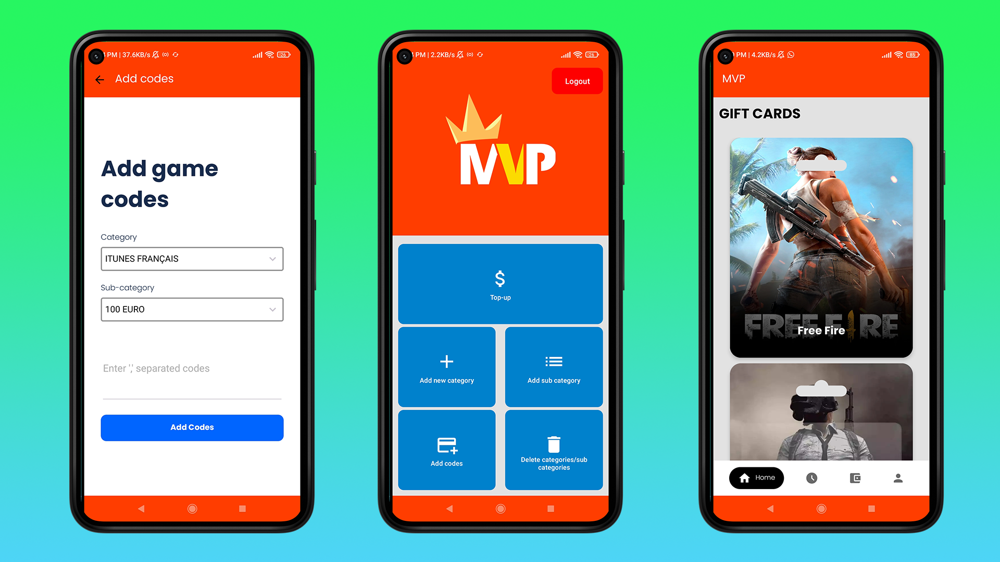
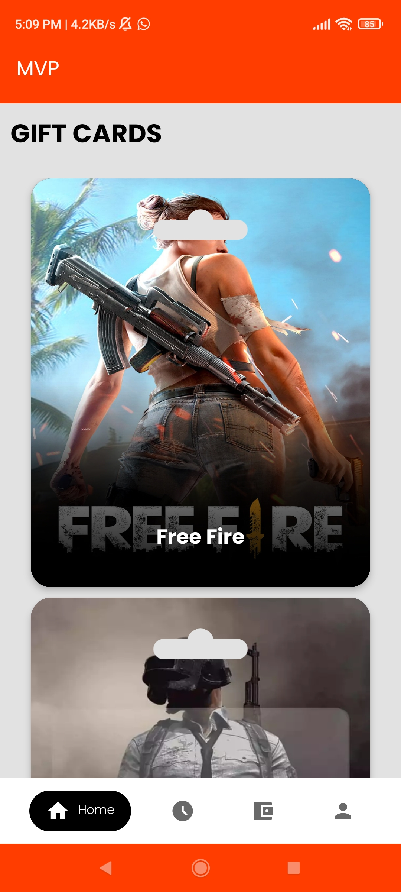
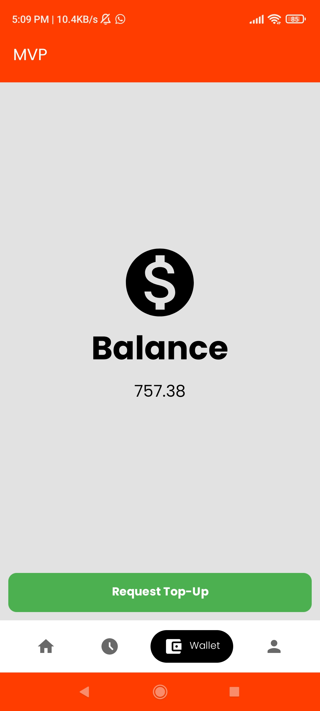
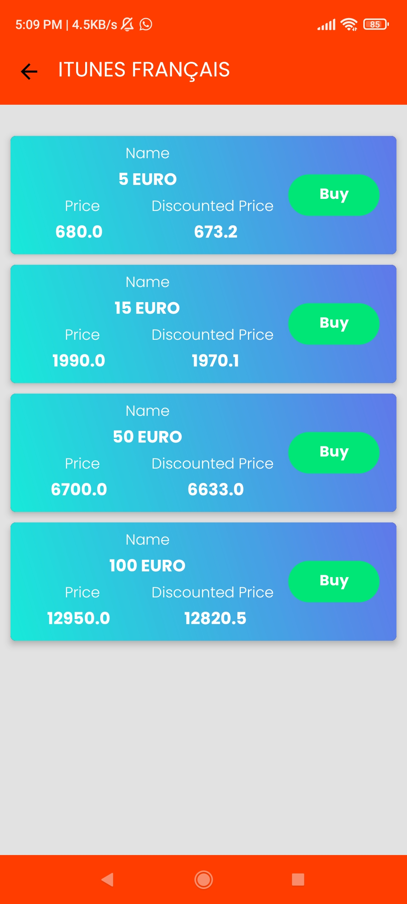
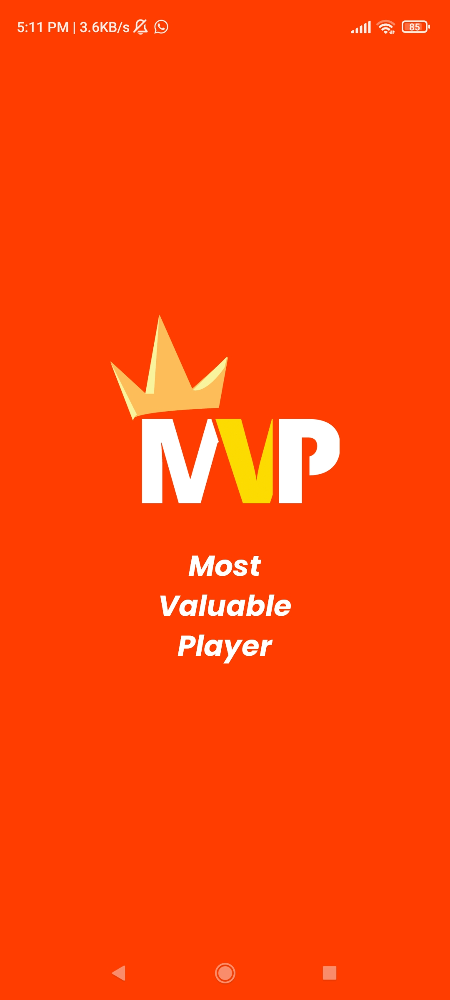
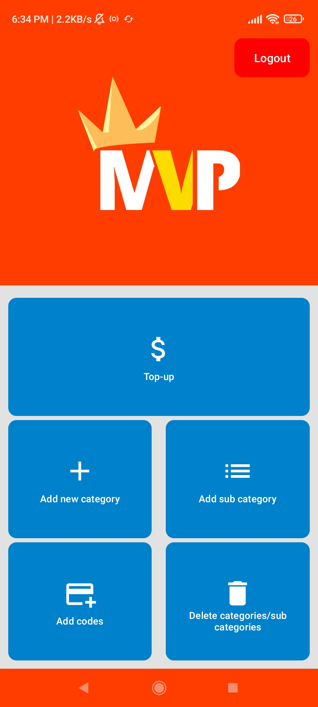
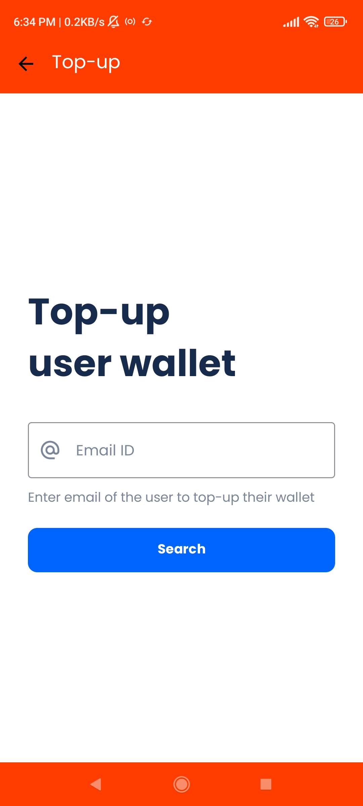
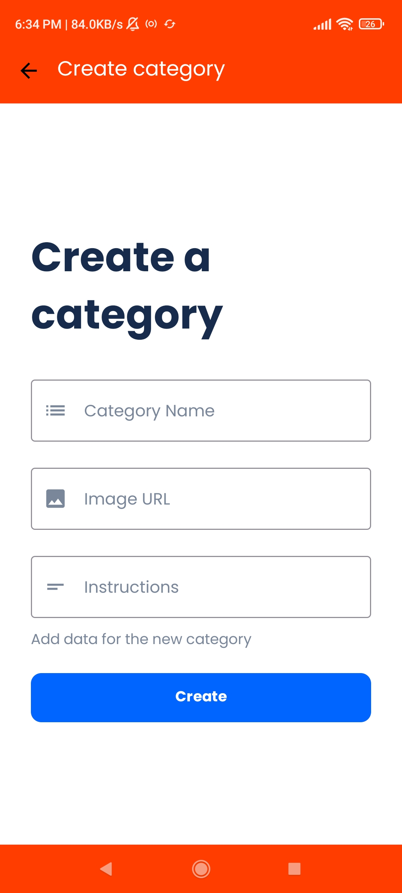
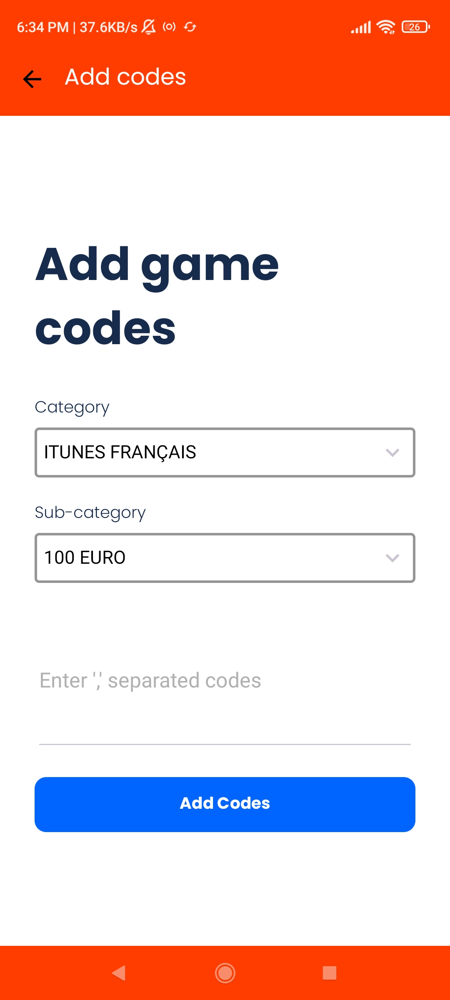

# MVP - Mobile Gift Card Applicaition 

MVP is a Gift Card application which consists of two apps, user app and admin app. 

### Features

User app features:
- Redeem gift cards
- Check previously redeemed card history
- Check physical store of the company on the map
- Check balance and top-up currency

Admin app features:
- Add Gift card categories
- Add Gift card sub-categories
- Add gift card codes in bulk
- Process user top-up
- Delete categories and sub-categories

### Screenshots

*This is a project that I did for a client. Contact for more information about the application*
